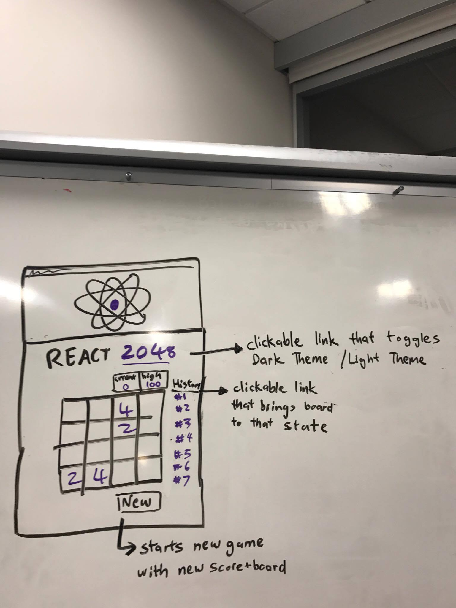
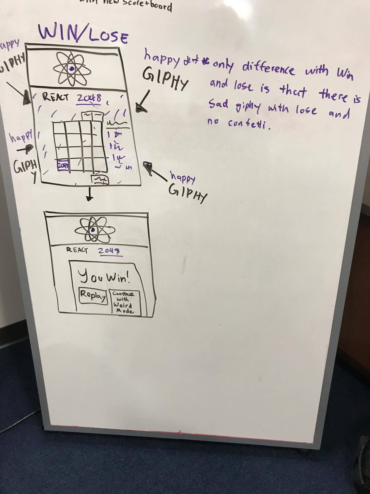

## Project Description

I wanted to practice my skills in using React. I thought the best way to practice
React would be to build 2048 Game with React. This would allow me to practice
passing data and practice invoking methods from parent components.

So far working on this project got me very comfortable with React. I undestand
the relationship of Components, Methods, and functions. I am very comfortable
with state, props, and passing down functions to be called on an event.

I want to incorporate animation library specifically animate.css into this project. I hope that it can be easily intergrated with React.
I also want to use giphy API too. It would be funny to have a crazy gip appear
if a user gets 2048 or messes up. Plus it would let me practice using React with
an API. I also want to practice my styling in React. I would probably write raw
css or react-bootstrap. It would be cool to have the theme of the website completely
change when a user completes a higher square in the game.

## Table of Contents

1. [Technologies](#technologies)
2. [WireFrames](#wireframes)
3. [User Stories](#user-stories)
4. [Development](#development)
5. [Problem Solving Strategy](#problem-solving-strategy)
6. [Unsolved Problems](#unsolved-problems)
7. [Solution to Unsolved Problems](#solution-to-unsolved-problems)
8. [Takeaways](#takeaways)
9. [Future Tasks](#future-tasks)

## Technologies

-   [React Library](https://reactjs.org/)
-   [Giphy API](https://developers.giphy.com/)
-  [Animate.css](https://github.com/daneden/animate.css)
-   [React-BootStrap](https://react-bootstrap.github.io/) (maybe)
-   [JavaScript](https://www.javascript.com/)
-   [CSS](https://developer.mozilla.org/en-US/docs/Web/CSS)

## Wireframes

## User Stories
1. As a user, I want to be able to see my score, so I know how I am doing.
2. As a user, I want to be able to restart a game, so I can keep playing.
3. As a user, I want to see cool animations, so I can have a great experience.
4. As a user, I want to see an appealing website, so I can have a great experience.
5. As a user, I want the board to render according to my arrow keys, so the game is working.
6. As a user I want to see my current and highscore because I am competitive.
7. As a user I want to click on links under History, so I can go back in time and correct my mistakes.
8. As a user I want a congratulatory message when I win, so I feel good about myself and a sense of accomplishment.
9. As a user I want a loser message when I lose, so I know I messed up.

## Development

- coming soon
- sneak peek
- (a lot of whiteboarding, psuedo code during class, rubber ducking, stack overflow, google, daydreaming, playing a lot of 2048)
- try to have at least 5 commits per day

## Problem Solving Strategy

- coming soon
- sneak peek
- (a lot of whiteboarding, psuedo code, referencing github repositories that have similiar issues that i have, mdn js docs)

## Unsolved Problems

coming soon

## Solution to Unsolved Problems

coming soon

## Takeaways

1. Understand how to use React Components, props, states, and methods.

## Future Tasks

coming soon
